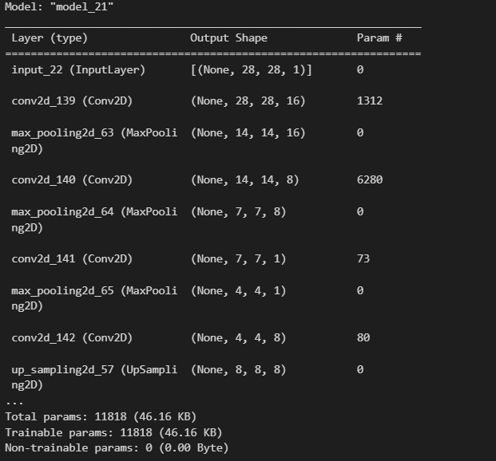
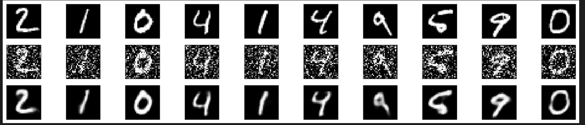

# Convolutional Autoencoder for Image Denoising

## AIM

To develop a convolutional autoencoder for image denoising application.

## Problem Statement and Dataset

AutoEncoder is used to denoise the image. The image is first encoded that is reduced its dimension and then the image is upscaled to denoise the image.
DataSet:
MNIST dataset from tensorflow

## Convolution Autoencoder Network Model

## DESIGN STEPS

### STEP 1: Import the required modules.

### STEP 2: Split the data into train and test

### STEP 3: Preprocess the data

### Step 4: Build the auto encoder

### Step 5: Compile and fit the model

## PROGRAM

```
# developed by : SRIJITH R 212221240054
from tensorflow import keras
from tensorflow.keras import layers
from tensorflow.keras import utils
from tensorflow.keras import models
from tensorflow.keras.datasets import mnist
import numpy as np
import matplotlib.pyplot as plt

(x_train, _), (x_test, _) = mnist.load_data()

x_train_scaled = x_train.astype('float32') / 255.
x_test_scaled = x_test.astype('float32') / 255.
x_train_scaled = np.reshape(x_train_scaled, (len(x_train_scaled), 28, 28,1))
x_test_scaled = np.reshape(x_test_scaled, (len(x_test_scaled), 28, 28,1))

noise_factor = 0.5
x_train_noisy = x_train_scaled + noise_factor * np.random.normal(loc=0.0, scale=1.0, size=x_train_scaled.shape)
x_test_noisy = x_test_scaled + noise_factor * np.random.normal(loc=0.0, scale=1.0, size=x_test_scaled.shape)

x_train_noisy = np.clip(x_train_noisy, 0., 1.)
x_test_noisy = np.clip(x_test_noisy, 0., 1.)

n = 10
plt.figure(figsize=(30, 10))
for i in range(1, n + 1):
    ax = plt.subplot(1, n, i)
    plt.imshow(x_test_noisy[i].reshape(28, 28))
    plt.gray()
    ax.get_xaxis().set_visible(False)
    ax.get_yaxis().set_visible(False)
plt.show()

input_img = keras.Input(shape=(28, 28, 1))

x = layers.Conv2D(16,(9,9),activation = 'relu',padding = 'same')(input_img)
x = layers.MaxPool2D((2,2),padding='same')(x)
x = layers.Conv2D(8,(7,7),activation = 'relu',padding = 'same')(x)
x = layers.MaxPool2D((2,2),padding='same')(x)
x = layers.Conv2D(1,(3,3),activation = 'relu',padding = 'same')(x)
encoded = layers.MaxPooling2D((2, 2), padding='same')(x)

x = layers.Conv2D(8,(3,3),activation = 'relu',padding = 'same')(encoded)
x = layers.UpSampling2D((2,2))(x)
x = layers.Conv2D(8,(5,5),activation = 'relu',padding = 'same')(x)
x = layers.UpSampling2D((2,2))(x)
x = layers.Conv2D(16,(3,3),activation = 'relu')(x)
x = layers.UpSampling2D((2,2))(x)
decoded = layers.Conv2D(1, (9, 9), activation='sigmoid', padding='same')(x)

autoencoder = keras.Model(input_img, decoded)

autoencoder.fit(x_train_noisy, x_train_scaled,
                epochs=2,
                batch_size=1024,
                shuffle=True,
                validation_data=(x_test_noisy, x_test_scaled))

decoded_imgs = autoencoder.predict(x_test_noisy)

n = 10
plt.figure(figsize=(20, 4))
for i in range(1, n + 1):
    # Display original
    ax = plt.subplot(3, n, i)
    plt.imshow(x_test_scaled[i].reshape(28, 28))
    plt.gray()
    ax.get_xaxis().set_visible(False)
    ax.get_yaxis().set_visible(False)

    # Display noisy
    ax = plt.subplot(3, n, i+n)
    plt.imshow(x_test_noisy[i].reshape(28, 28))
    plt.gray()
    ax.get_xaxis().set_visible(False)
    ax.get_yaxis().set_visible(False)

    # Display reconstruction
    ax = plt.subplot(3, n, i + 2*n)
    plt.imshow(decoded_imgs[i].reshape(28, 28))
    plt.gray()
    ax.get_xaxis().set_visible(False)
    ax.get_yaxis().set_visible(False)
plt.show()
```

## OUTPUT



### Original vs Noisy Vs Reconstructed Image



## RESULT

Thus the autoencoder to denoise the given image is programmed using tensorflow.
